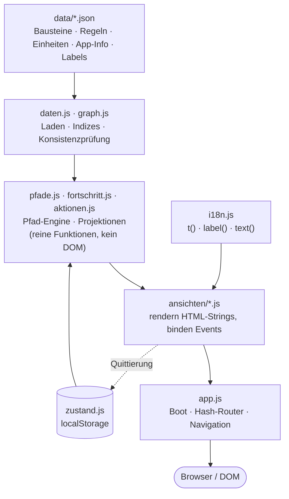

# Entwicklung & Architektur

Technische Referenz für Beitragende und KI-Assistenten. Für Konzept und Angebot der App siehe die [README](README.md); den Leitfaden für Änderungen (nicht verhandelbare Regeln, Fallstricke) trägt [`CLAUDE.md`](CLAUDE.md); die vollständige Konzeption die [Spezifikation](docs/uebergabe-spezifikation.md).

---

## Architektur auf einen Blick

Rein statisch: HTML/CSS/JS als ES-Module, **kein Build-Schritt, keine Server-Komponente, keine npm-Laufzeitabhängigkeit**. Inhalte kommen aus JSON in `data/`, Fortschritt lebt in `localStorage`. Die Logik ist DOM-frei in einer Engine gekapselt; die Ansichten lesen sie nur.



**Nicht verhandelbare Prinzipien** (Details in `CLAUDE.md`):

- **Rein clientseitig.** Keine Abhängigkeit, die einen Bundler oder eine Laufzeit voraussetzt. Bibliotheken nur als lokal eingecheckte statische Datei (wie die Schriften).
- **Inhalt getrennt vom Pfad.** Es gibt *einen* Baustein-Pool; die Pfade sind Traversierungen darüber. Inhalt wird nie dupliziert.
- **Identität getrennt von Beschriftung.** Sprachneutrale IDs in der Inhalts-JSON, sichtbare Texte in `data/labels/<sprache>.json` — immer über `t()`/`label()`/`text()`.
- **Fortschritt ist baustein-gebunden.** Status hängt am Baustein, nie am Pfad.
- **Zwei-Ebenen-Logik.** Der Voraussetzungsgraph *sortiert* nur, er *sperrt nie*.

### Schichten (wo was liegt)

| Ebene | Dateien | Regel |
| --- | --- | --- |
| Daten | `js/daten.js`, `js/graph.js` | reine Funktionen, kein DOM; Indizes + Konsistenzprüfung |
| Engine | `js/pfade.js`, `js/fortschritt.js`, `js/aktionen.js`, `js/plan.js` | reine Funktionen über Daten + Zustand → annotierte Listen; **kein DOM** (`plan.js` erzeugt den Trainingsplan deterministisch, ohne `Date.now()`) |
| Zustand | `js/zustand.js` | einziger localStorage-Zugriff, versioniertes Schema |
| i18n | `js/i18n.js` | alle sichtbaren Texte laufen hier durch |
| Ansichten | `js/ansichten/*.js` | rendern HTML-Strings + binden Events; lesen die Engine, mutieren nie direkt |
| Shell | `js/app.js` | Boot, Hash-Router, Navigation, Footer, Sprachanzeige |

## Starten (lokal)

Die Inhalte werden zur Laufzeit per `fetch()` geladen — dafür braucht es HTTP (ein Doppelklick auf `index.html` genügt nicht, `file://` blockiert das Laden). Lokal reicht ein Einzeiler im Projektordner:

```sh
python3 -m http.server 8000
# oder: npx serve
```

Dann `http://localhost:8000` öffnen.

## Veröffentlichen

Die App ist reine Statik — **auf dem Server braucht es weder Node noch Python**, keine Datenbank, keine Laufzeitumgebung. Node/Python dienen oben nur als lokale Vorschau-Server.

- **GitHub Pages** (eingerichtet): Jeder Push auf `main` veröffentlicht automatisch über [`.github/workflows/deploy-pages.yml`](.github/workflows/deploy-pages.yml) nach `https://daimpad.github.io/crossminton-handbook/`. Vorher laufen die Engine-Tests als Qualitätsschranke.
- **Eigener Webspace**: alle Dateien des Repos (ohne `.git`, `.github`, `tests`, `docs`) per FTP/SFTP in ein Verzeichnis hochladen — fertig. Es genügt jeder Webserver, der Dateien ausliefert (Apache, nginx, Shared Hosting). Alle Pfade sind relativ, die App läuft daher auch in Unterverzeichnissen.

## Tests

Die Pfad-Engine wird ohne Abhängigkeiten direkt unter Node gegen die Referenzdaten geprüft:

```sh
node tests/engine.test.mjs
```

Abgedeckt: Datenvalidierung, Kompetenz-/Themen-/Individualpfad (inkl. Mehrfach-Zielauswahl und Stufen-Kumulation), Cross-Sport-Modifikator (Delta-Einblendung, Skip-Kandidaten, Nicht-Fehlerfall), Experten-Herkunftsneutralität, Trainer-Gatung, Zwei-Ebenen-Logik, Projektionen, Kontinuität, die eigenen Entitäten (Regeln, Trainingseinheiten, App-Info) und die Vollständigkeit der de-Labels.

Ein durchgehender End-to-End-Browsertest (Playwright, mobil + Desktop) liegt außerhalb des Repos in der Entwicklungsumgebung; sein Ablauf ist in [`.claude/skills/verify/SKILL.md`](.claude/skills/verify/SKILL.md) dokumentiert. **Verifikation heißt: die laufende App beobachten, nicht nur Tests laufen lassen.**

## Projektstruktur

```
index.html                 App-Shell (SPA, Hash-Routing), Header (Sprachanzeige), Footer, Modul-Auffangnetz
sw.js                      Service Worker (Offline, buildfrei): App-Hülle vorladen + stale-while-revalidate
css/app.css                Design & CI (#38a4f1 + Signalfarben), mobile Bottom-Bar / Desktop-Hamburger
css/schriften.css          lokale Schriften: Rubik + Font-Awesome-Subset (Icons ergänzen = eine Codepoint-Zeile)
assets/fonts/              woff2-Dateien inkl. Lizenzen (OFL / FA Free)
assets/images/speeder.svg  Speeder-Logo (Marke, README)
js/
  app.js                   Boot, Router, Navigation, Hamburger-Menü, Footer, Sprachanzeige
  daten.js                 JSON laden, Indizes, Konsistenzprüfung
  graph.js                 topologische Sortierung, Voraussetzungs-Checks
  pfade.js                 Pfad-Engine: Traversierungen + Cross-Sport-Modifikator + Trainer-Gatung
  fortschritt.js           Projektionen über den baustein-gebundenen Status
  aktionen.js              Quittierungen + Meilenstein-Erkennung
  plan.js                  Trainingsplan-Generierung (deterministisch): Wochenplan + .ics-Export
  zustand.js               localStorage-Store (Diagnose, Fortschritt, Kontinuität, Einstellungen, Plan)
  i18n.js                  t()/label()/text() mit de-Fallback
  oberflaeche.js           geteilte UI-Helfer, Baustein-Icons
  ansichten/               Willkommen, Onboarding, Heim, Pfadlisten, Baustein, Training, Trainingsplan, Regeln, Info, Profil, Zielwahl
data/
  bausteine.<stufe>-<domaene>.json   Inhaltsblöcke (Beginner/Fortgeschritten/Experte/Trainer), zu EINEM Pool gemischt
  bausteine.delta-<herkunft>.json    herkunftsreine Cross-Sport-Deltas (Tennis, Squash)
  bausteine.doppel-thema.json        Doppel als Querschnittsthema (Dimension spielform:doppel)
  fehlerbilder.json                  Trainer-Layer je Baustein (Symptom/Ursache/Korrektur), in-situ gerendert
  trainingseinheiten.json            kuratierte Einheiten in drei Phasen, stufen-/spielform-getaggt
  regeln.json                        Regeln-Reiter: offizielle Spielregeln (ICO/DCV) — eigene Entität, nicht im Pool
  app-info.json                      „Über"/„Mitmachen"/Rechtstexte + Sprachanzeige + Version — eigene Entität, nicht im Pool
  labels/de.json                     alle sichtbaren Beschriftungen (Quellsprache)
  labels/{en,fr,pl}.json             strukturgleiche Gerüste, unbefüllt → Fallback auf de
docs/uebergabe-spezifikation.md      Spezifikation (Konzeption)
docs/ci.md                           Corporate Identity: Farben, Typo, Icons
tests/engine.test.mjs                Engine-Tests (node, dependency-frei)
CLAUDE.md                            Leitfaden für Beitragende / KI-Assistenten
LICENSE                              MIT (Software)
```

## Datenpflege

- **Inhalte** (`data/bausteine.<stufe>-<domaene>.json`): Quellformat gemäß Spezifikation, Abschnitt 3. Mehrere Inhaltsdateien werden zu einem Pool gemischt — neue Datei in `INHALTSDATEIEN` (`js/daten.js`) eintragen; nur die Technik-Datei trägt das kanonische `vokabulare`. Bausteine können einen inline-`anzeigetitel` tragen (wird nach `labels/de.json` geliftet) und statt des Übungsteils eine `reflexionsaufgabe` (eigener quittierbarer Aufgabenteil). Ein passendes Icon lässt sich in `js/oberflaeche.js` (`BAUSTEIN_ICONS`) ergänzen. Die Engine-Tests prüfen Titel-Vollständigkeit, Reihenfolge und Reflexions-Status mit. Zwei Sonderfälle: die **Experten-Stufe** (`bausteine.experte-technik.json`, `bausteine.experte-taktik.json`) ist herkunftsneutral (keine Deltas — der Cross-Sport-Modus fällt dort durch); reine **Trainer-Blöcke** (`bausteine.trainer-trainingsgestaltung.json`, `kompetenzstufe: ["trainer"]`, Dateiname mit `trainer` an Stufen-Stelle) sind orthogonal zur Könnensstufe und in allen Pfaden hinter der Trainer-Perspektive gated.
- **Beschriftungen** (`data/labels/de.json`): Erstfassungen aus der Implementierung — redaktionell prüfen. Nach dem Hinzufügen neuer de-Schlüssel die Skelette `data/labels/{en,fr,pl}.json` regenerieren (leere Werte fallen zur Laufzeit auf de zurück).
- **Fehlerbilder / Trainer-Layer** (`data/fehlerbilder.json`): eigene Entitäten mit `basis_baustein`-Relation, `typ: "fehlerbild"`, `kompetenzstufe: ["trainer"]`, `erklaerteil.de` mit den Feldern `symptom`/`ursache`/`korrektur`, kein Übungsteil. Nur in der Trainer-Perspektive in-situ im Basisbaustein gezeigt, nie als eigene Station. Jedes braucht einen Titel in `data/labels/de.json` unter `fehlerbilder`.
- **Trainingseinheiten** (`data/trainingseinheiten.json`): kuratierte Einheiten in drei Phasen (`phasen.{erwaermung, hauptteil, ausklang}`) mit je `{baustein, hinweis}`-Referenzen auf Bausteine, deren **Übungsteil** gemeint ist (nie Reflexions-Bausteine). Jede Einheit trägt `titel` (geliftet), `kompetenzstufe` (stufen-kumulative Filterung), `spielform`, `schwerpunkt`, `beschreibung`. Auf diesem Bestand generiert der **Trainingsplan** (`js/plan.js`, Route `#/plan`) einen anpassbaren Wochenplan — kein eigener Datenbestand, sondern eine Traversierung/Terminierung der Einheiten; der Plan wird im `plan`-Slice des Zustands gehalten und als PDF (Druckansicht) bzw. Kalender (`.ics`) exportiert.
- **Regeln** (`data/regeln.json`): eigener Referenz-Reiter (`#/regeln`), **nicht im Pool**. `abschnitte[]` (auf-/zuklappbar) mit `regeln[]`; jede Regel trägt `inhalt` (akkurat, optional `nummer`) und optionale `erklaerung` (Du-Form). `_meta.quelle` (Herausgeber + Stand) wird im Reiter angezeigt. Optionale `querverweis`-IDs sind reine Dokumentation.
- **App-Info** (`data/app-info.json`): die Reiter `#/ueber`, `#/mitmachen`, die Rechtstexte `#/impressum`/`#/datenschutz` (Footer), die Sprachanzeige und die `_meta.version` (Footer) — statischer Referenzinhalt, **nicht im Pool**. Platzhalter in `[eckigen Klammern]` bleiben **sichtbar**, bis der Betreiber sie ersetzt; echte `http`-Ziele werden zu Links. Nur die UI-Labels (`nav_*`, `footer_*`) liegen in `labels/de.json`, aller Fließtext inline über `text()`.
- **Übersetzungen**: Werte in `data/labels/{en,fr,pl}.json` befüllen; leere Werte fallen zur Laufzeit auf `de` zurück. Baustein-Texte werden je Sprache direkt in der Inhaltsdatei ergänzt (`erklaerteil.en` usw.).

## Bewusste Ausbaustufen (strukturell vorgehalten, nicht umgesetzt)

- Schlanke Server-Komponente für geräteübergreifenden Fortschritt.
- Funktionales Sprach-Umschalten für die Zielsprachen (Struktur angelegt; die Sprachanzeige im Header ist derzeit rein darstellend, der Umschalter im Profil funktional für de/en/fr/pl).
- Abschluss-Status `beherrscht` (Mastery): im Zustandsraum vorgesehen, heute inaktiv — Aktivierung ohne Datenmigration.
- Regelbasierte Generierung von Trainingseinheiten; Grafiken (Platzhalter mit Bildunterschriften sind eingebaut, KI-Prompts siehe Spezifikation, Anhang B).
