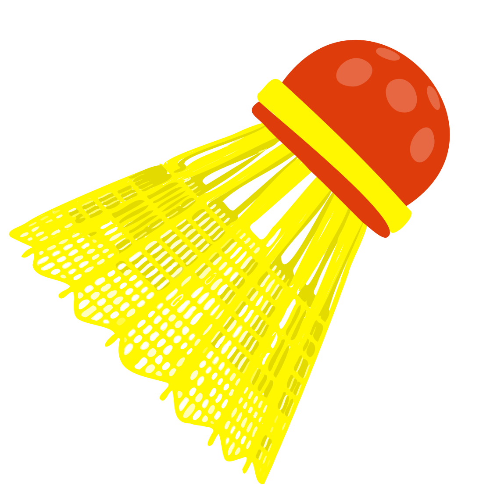

# Crossminton-Handbuch

**Crossminton lernen — Schlag für Schlag.**

Eine clientseitige, mobil-orientierte Lernapp für Crossminton: kleine Bausteine, klare Technik, dein Tempo. Läuft komplett im Browser — ohne Anmeldung, ohne Server, dein Fortschritt bleibt auf deinem Gerät.

### [**→ App öffnen**](https://daimpad.github.io/crossminton-handbook/)

---

## 🏸 Worum es geht

Das Crossminton-Handbuch bringt dir das Spiel in kleinen, aufeinander aufbauenden Schritten bei — von den ersten Schlägen bis zum Feinschliff auf Expertenniveau. Die Inhalte sind sachlich gehalten und auf gesicherte Grundlagen aus Trainingslehre und Sportwissenschaft gestützt. Die App will dich zum **eigenständigen Üben** anleiten, nicht zu Dauerbeschäftigung.

## ✨ Was die App bietet

- **Dein Einstieg, deine Wahl** — direkt ins Handbuch stöbern oder den geführten Weg über eine kurze Stufen-Diagnostik gehen.
- **Fünf Wege durch denselben Stoff** — Kompetenz-, Themen-, Individual- und Trainingspfad, dazu das **Doppel** als eigenes Querschnittsthema.
- **Cross-Sport-Modus** — wer aus Badminton, Tennis oder Squash kommt, bekommt gezielt angepasste Erklärungen, wo sich gewohnte Bewegungen unterscheiden.
- **Drei Könnensstufen** — Beginner, Fortgeschritten und Experte, kumulativ aufeinander aufbauend; dazu eine **Trainer-Perspektive** mit Vermittlungswissen.
- **Regeln-Reiter** — die offiziellen Spielregeln (ICO/DCV), akkurat wiedergegeben und in Klartext erklärt.
- **Dein Fortschritt, lokal** — getrennt quittierte Erklär- und Übungsteile, Meilensteine und kumulative Kontinuität, alles im Browser gespeichert.
- **Mobil zuerst** — hell, schnell, mit Bottom-Bar auf dem Handy und Hamburger-Menü ab Tablet; mehrsprachig angelegt (de · en · fr · pl).

 
<strong>Kein Konto. Kein Tracking. Keine Server.</strong> 
Nur du und das Spiel.

## 🚀 Loslegen

Kein Download, keine Installation — einfach öffnen:

### [daimpad.github.io/crossminton-handbook](https://daimpad.github.io/crossminton-handbook/)

Im Browser, auf dem Handy, als Lesezeichen auf dem Startbildschirm.

## 🤝 Mitmachen

Das Handbuch ist ein **offenes Projekt** und lebt von Beiträgen — ein Hinweis auf einen Fehler, eine Übersetzung oder Code. Du musst kein Profi sein. Der „Mitmachen"-Reiter in der App und die [Issues](https://github.com/daimpad/crossminton-handbook/issues) sind der beste Startpunkt.

## 📄 Lizenz

| | |
| --- | --- |
| **Software** | [MIT License](LICENSE) © 2026 Damian Paderta |
| **Inhalte & Texte** | [CC BY 4.0](https://creativecommons.org/licenses/by/4.0/) |
| **Spielregeln** | Eigentum der **ICO / DCV**, hier zu Lernzwecken wiedergegeben |

## 🛠️ Technik & Architektur

Alles Technische — **Setup, Architektur, Datenmodell, Tests, Projektstruktur und Datenpflege** — steht gebündelt in **[ENTWICKLUNG.md »](ENTWICKLUNG.md)**.

Konzeptionelle Grundlage: [`docs/uebergabe-spezifikation.md`](docs/uebergabe-spezifikation.md) · Erscheinungsbild: [`docs/ci.md`](docs/ci.md)

 
Gebaut mit purem HTML, CSS und JavaScript — kein Framework, kein Build-Schritt.

