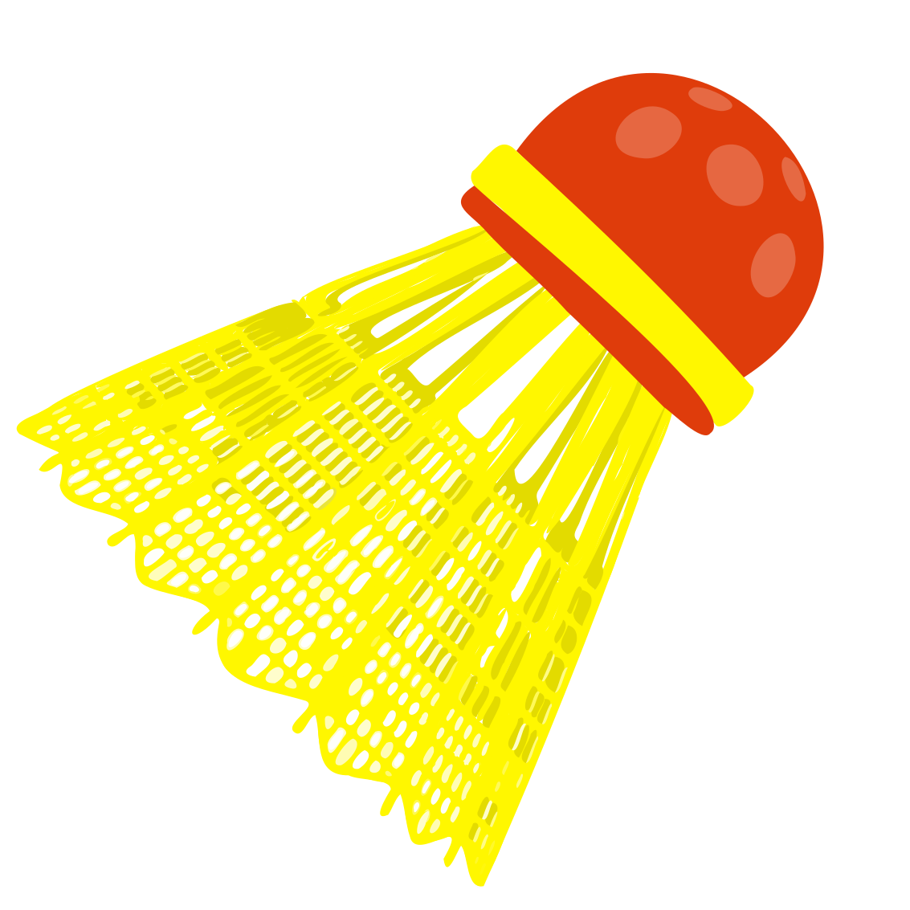

# Crossminton-Handbuch

**Das Lern- und Trainingshandbuch für Crossminton**

[**→ crossminton-handbook.de**](https://crossminton-handbook.de)

 

[-MIT-blue.svg)](LICENSE)
[-CC%20BY--SA%204.0-lightgrey.svg)](https://creativecommons.org/licenses/by-sa/4.0/)

---

## Was ist das?

Das Crossminton-Handbuch bündelt das Wissen über den Sport — Technik, Taktik, Mentales, Athletik und Ausrüstung — in einer App, die dich dort abholt, wo du stehst. Statt einem linearen Text bietet es **108 kleine, in sich geschlossene Lernbausteine**, die über weiche Verbindungen zu einem persönlichen Lernpfad zusammenwachsen.

Nichts ist gesperrt. Der Voraussetzungsgraph *sortiert* — er hält dich nie auf. Fehlt eine Grundlage, siehst du einen Hinweis, keine verschlossene Tür.

## Das Angebot

**Vier Wege durch denselben Stoff.** Es gibt einen Pool an Bausteinen und mehrere Arten, ihn zu durchqueren:

- **Kompetenzpfad** — die Leiter entlang deiner Könnensstufe. Kumulativ: 34 Bausteine für Einsteiger, 66 für Fortgeschrittene, 93 für Experten.
- **Themenpfad** — frei nach Feld stöbern: Technik (19), Taktik (29), Mentales (19), Athletik (19), Ausrüstung (7).
- **Individualpfad** — nur die Bausteine, die auf ein selbst gewähltes Ziel einzahlen.
- **Trainingspfad** — 8 kuratierte Einheiten in drei Phasen (Erwärmung, Hauptteil, Ausklang), die die Übungsteile zu echten Sessions verbinden.

**Dazu Querschnittsthemen**, die quer über Stufen und Domänen laufen:

- **Umsteiger-Hinweise** — wer aus Badminton, Tennis oder Squash kommt, bekommt die entscheidenden Unterschiede genau dort, wo eine mitgebrachte Gewohnheit kollidiert. Kein zusätzliches Kapitel: der Hinweis tritt an die Stelle der Erklärung, der Übungsteil bleibt derselbe.
- **Das Doppel** — 18 Bausteine über alle drei Stufen, vom ersten Zusammenspiel bis zum eingespielten Paar als System.
- **Draußen spielen** — 10 Bausteine zu Wind, Sonne, Nässe, Hitze, Kälte und verschiedenen Böden, inklusive Snow-, Beach- und Blackminton.
- **Ausrüstung** — Speeder, Schläger, Schuhe, Kleidung, Bespannung und Griffband.

**Und als Nachschlagewerk:**

- **Spielregeln** — 44 Regeln in 13 Abschnitten, jede mit einer Erklärung in klarer Sprache, auf Grundlage des offiziellen ICO-Regelwerks (Stand 2024).
- **Turnier-Regularium** — was für eine Turnierstufe gilt, interaktiv gefiltert: 5 Stufen, 26 Anforderungen, dazu die Abweichungen für Doppel- und Junior-Konkurrenzen.

## Werkzeuge

- **Trainingsplan** — verteilt Einheiten über bis zu zwölf Wochen und achtet dabei auf Belastungswechsel und thematische Abwechslung. Export als PDF oder Kalenderdatei.
- **KO-Turnier** — Namen eintragen, auslosen, Sieger antippen: die App baut das Bracket und hält fest, wer wie weit kam. Für den Spaßwettbewerb im Verein, kein offizielles Turniersystem.
- **Merkliste und Suche** — Bausteine für später vormerken, Volltextsuche über alle Inhalte.
- **Trainer-Perspektive** — wer unterrichtet, schaltet zusätzlich Vermittlungswissen und 32 typische Fehlerbilder frei: Symptom, Ursache, Korrektur.

## Für wen?

Für Einsteiger, die einen klaren ersten Weg suchen. Für Umsteiger aus verwandten Rückschlagsportarten, die schnell den Unterschied verstehen wollen. Für ambitionierte Spieler, die bis in die Experten-Feinheiten arbeiten. Und für Trainerinnen und Trainer, die Inhalte weitergeben.

## Immer dabei

Die App läuft vollständig im Browser — keine Anmeldung, keine Installation nötig, keine Werbung. Einmal geladen funktioniert sie **auch ohne Internet**, also auf dem Platz, in der Halle oder unterwegs. Als PWA lässt sie sich auf dem Startbildschirm ablegen.

Dein Fortschritt bleibt auf deinem Gerät (lokal im Browser) und wird nirgendwo hochgeladen.

## In vier Sprachen

Oberfläche **und** Inhalte liegen vollständig auf **Deutsch, Englisch, Französisch und Polnisch** vor — inklusive der Beschriftungen in allen 63 Diagrammen. Umschaltbar mit einem Klick.

## Technische Dokumentation

Alles Technische — Aufbau, Datenmodell, Architektur, Setup und die vollständige Spezifikation:
📄 **[Technische Dokumentation →](docs/TECHNICAL.md)**

## Mitmachen

Beiträge sind willkommen — Fehler melden, übersetzen, Code beitragen. Die Details stehen im Reiter „Mitmachen" der App und in der [technischen Dokumentation](docs/TECHNICAL.md).

## Lizenz

Dieses Projekt trennt Code und Inhalt:

- **Quellcode** — [MIT-Lizenz](LICENSE)
- **Inhalte** (Texte, Didaktik, Grafiken) — [CC BY-SA 4.0](https://creativecommons.org/licenses/by-sa/4.0/)

Erstellt in Zusammenarbeit mit der Crossminton-Community. Regelgrundlage: offizielle ICO/DCV-Spielregeln.

Speeder™ ist eine Marke der jeweiligen Rechteinhaber. Dieses Projekt steht in keiner offiziellen Verbindung zur ICO.

